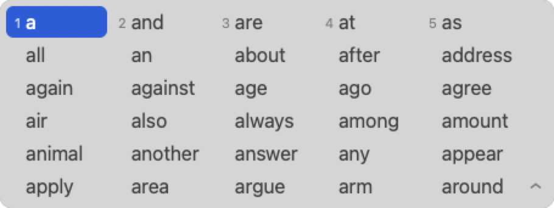

# 横向候选窗改造版

这是 [hallelujahIM](https://github.com/dongyuwei/hallelujahIM) 的改造版本，把候选词面板从系统自带的**单列纵向**列表换成了**自绘的横向菜单**，并支持按 `↓` 展开成多行网格。

其余功能（词库、拼写校正、Text-Expander、拼音输入中文、上下文预测等）与上游完全一致。

## 效果

**默认：横向一行**

<picture>
  <source media="(prefers-color-scheme: dark)" srcset="docs/images/candidates-dark.png">
  
</picture>

**按 `↓` 展开：5 列 × 最多 6 行**

<picture>
  <source media="(prefers-color-scheme: dark)" srcset="docs/images/candidates-dark-expanded.png">
  
</picture>

深色模式跟随系统自动切换。

**菜单栏与切换提示的图标**


图标是「圆角方块挖空一个『英』字」的模板图标，跟系统自带输入法同一个画法——上图左起是系统的「拼」和「简」，最右是本输入法。尺寸 16×16pt、圆角 0.152H、字形墨迹 0.6875H，这几个数都是量自系统图标的（它们藏在 `SCIM.app/Contents/PlugIns/SCIM_Extension.appex/Contents/Resources/` 里）。

模板图标只有 alpha 有意义，由系统按场景填色：


依次是输入法列表里的浅色场景、切换输入法的 HUD、深色场景。

## 按键

| 按键 | 收起状态（单行） | 展开状态（网格） |
| --- | --- | --- |
| `←` `→` | 左右换候选 | 左右换候选 |
| `↓` | 展开 | 下移一行 |
| `↑` | 不接管，交回应用 | 上移一行；已在首行则收起 |
| `Tab` | 展开 | 跳到下一行同列，末行循环回首行 |
| `1`~`9` | 选中当前行第 n 个 | 选中当前行第 n 个 |
| `Enter` / `Space` | 提交选中项 | 提交选中项 |
| 鼠标 | 点击选词，点末尾 `⌄` 展开 | 点击选词，点末尾 `⌃` 收起 |

## 安装

### 方式一：pkg 安装包（推荐）

从 [Releases](../../releases) 下载 `hallelujah-horizontal-*.pkg`，双击安装。安装脚本会自动注册并激活输入法，装完在 `系统设置 › 键盘 › 输入法` 里就能看到。

首次安装后如果输入法没反应，注销重登录一次。

pkg 是 ad-hoc 签名的（没有 Apple 开发者证书），首次打开若被 Gatekeeper 拦下，在 `系统设置 › 隐私与安全性` 里点「仍要打开」。

### 方式二：自己编译

只需要 Command Line Tools，**不需要装 Xcode**：

```bash
xcode-select --install          # 如果还没装过
git clone <本仓库地址>
cd hallelujahIM
bash build-standalone.sh        # 产物：build/hallelujah.app
bash install.sh                 # 装到 /Library/Input Methods/
```

`install.sh` 会先把系统里已有的 hallelujah 备份到 `hallelujah-原版备份.app`，想退回去就跑 `bash rollback.sh`。

想自己打 pkg：

```bash
bash package/build-package-noxcode.bash   # 产物：dist/*.pkg
```

## 改动了什么

| 文件 | 说明 |
| --- | --- |
| `src/CandidateWindow.h` `.m` | 新增。自绘候选窗的全部实现：布局、绘制、键盘导航、鼠标交互、展开/收起 |
| `src/InputController.h` `.mm` | 候选窗从 `IMKCandidates` 换成 `CandidateWindow`，重写方向键/数字键处理 |
| `src/main.mm` | 去掉 `sharedCandidates` 和翻译窗 nib 的加载；`showTranslation` 默认关闭 |
| `Info.plist` | 菜单栏图标改用 `himTemplate.tiff` 模板图标 |
| `make-icon.m` | 新增。生成多分辨率模板图标 TIFF 的小工具 |
| `preview-candidates.m` | 新增。不装输入法就能预览候选窗渲染效果，上面几张图就是它生成的 |
| `build-standalone.sh` | 新增。不依赖 Xcode 的自包含构建 |
| `package/build-package-noxcode.bash` | 新增。基于上面的构建产物打 pkg |

为什么要自绘：`IMKCandidates` 的面板样式、尺寸和末尾控件行为都由系统定死，换不成「点击展开」，也调不了列数和宽度。

预览图重新生成：

```bash
clang -fobjc-arc -framework Cocoa preview-candidates.m src/CandidateWindow.m -Isrc -o /tmp/preview
/tmp/preview docs/images/candidates-light.png
/tmp/preview docs/images/candidates-light-expanded.png expanded
/tmp/preview docs/images/candidates-dark.png dark
/tmp/preview docs/images/candidates-dark-expanded.png expanded dark
```

## 许可

与上游一致，GPL v3。原作者 [dongyuwei](https://github.com/dongyuwei)。
